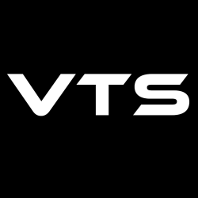

# VTStatic
<p align="center">
    *
</p>

<h2>GUI Interface to smooth movement input/output management in VTube Studio</h2>

# Flow
- Auth to VTS
- Get path to the model
- Change values of default and custom parameters in file
- Reload the model
- Keep the information about previous sets of parameters externally (for backup)

# GUI
- Created with Kivy

# TODO
- generalize creating request jsons

# Licence
```
          DO WHAT THE FUCK YOU WANT TO PUBLIC LICENSE
                   Version 2, December 2004
 
Copyright (C) 2023 Mal Bayes

Everyone is permitted to copy and distribute verbatim or modified
copies of this license document, and changing it is allowed as long
as the name is changed.
 
           DO WHAT THE FUCK YOU WANT TO PUBLIC LICENSE
  TERMS AND CONDITIONS FOR COPYING, DISTRIBUTION AND MODIFICATION

 0. You just DO WHAT THE FUCK YOU WANT TO.
```

<small>*Logo subject to change</small>